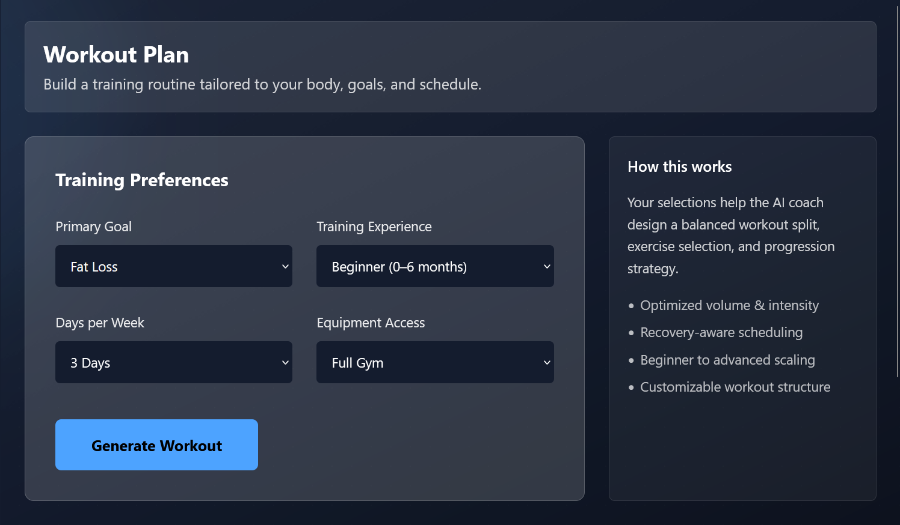
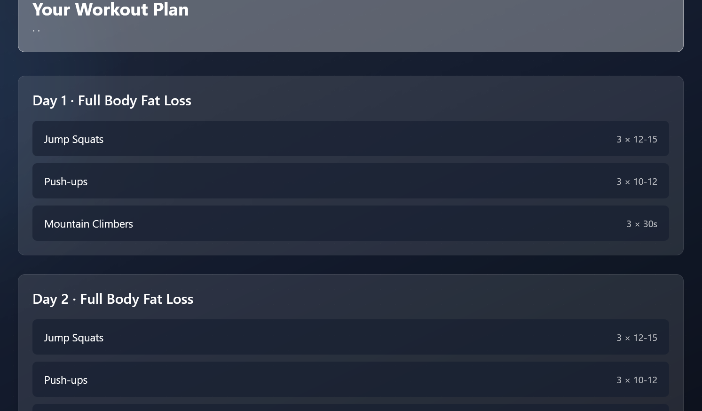
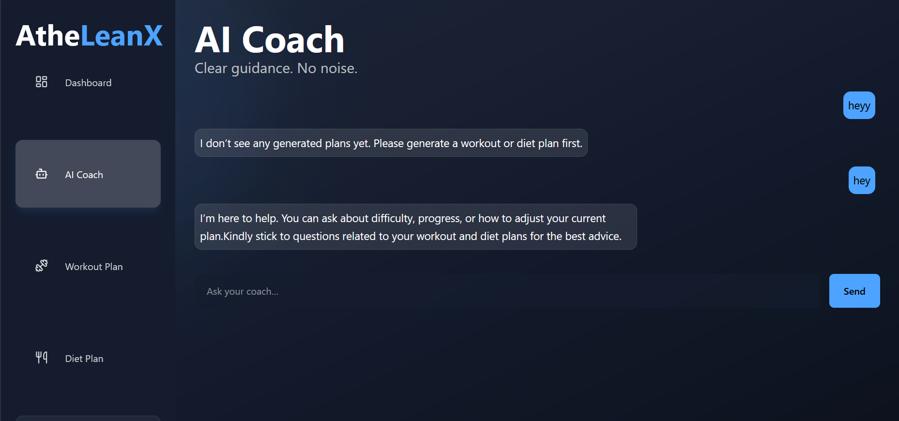
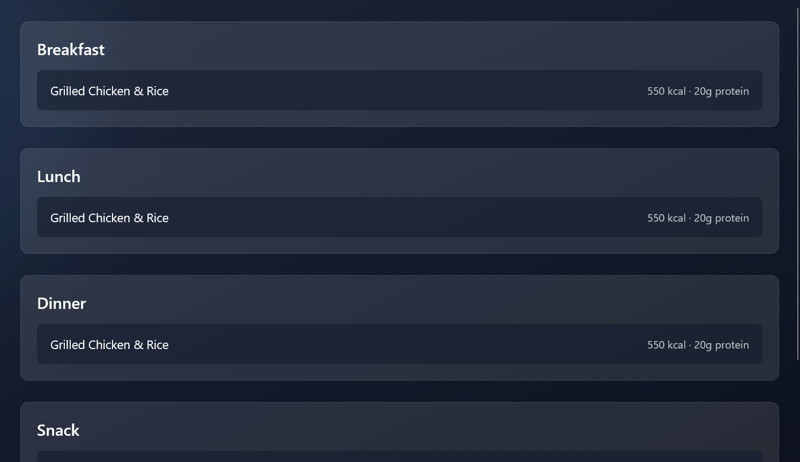
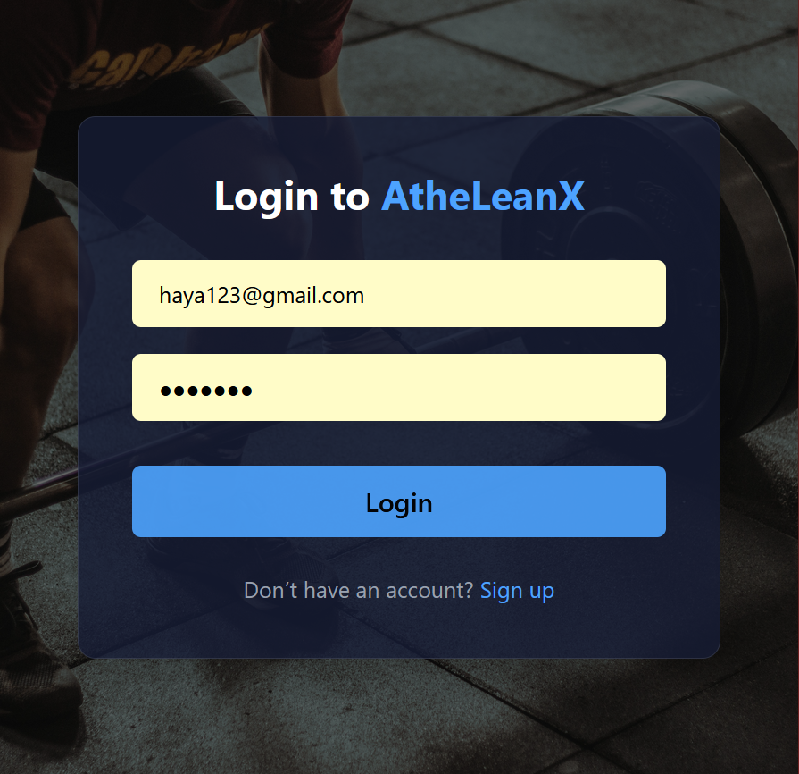

# 🏋️‍♂️ AtheLeanX Frontend 🧠

Frontend application for **AtheLeanX**, a schema-driven AI fitness platform.

This frontend is responsible for:
- User authentication (login/signup)
- Collecting structured fitness inputs
- Displaying AI-generated workout & diet plans
- Rendering AI coach conversations
- Managing user navigation and UX

> ⚠️ This is **not a prompt-based AI UI**.  
> Users never write prompts. All AI interaction is controlled by the backend.

---

## 🧠 Design Philosophy

- No free-form prompting
- No AI logic in frontend
- Frontend consumes **validated API responses only**
- Backend is the single source of truth
- UI is final; only backend wiring is allowed

---

## 🧩 Tech Stack

- **Framework**: React (JavaScript only)
- **Build Tool**: Vite
- **Styling**: TailwindCSS
- **Routing**: React Router
- **HTTP Client**: Axios
- **State**: Local component state
- **Auth Storage**: `localStorage` (JWT)

---
## 🔐 Authentication Flow

- Signup and login are **separate**
- **Signup** creates a user only (does not log in)
- **Login** returns a JWT token
- JWT is stored in `localStorage`
- Axios automatically attaches the token to all requests

### Protected Routes

- All routes under `/app/*` require authentication
- If the token is missing or invalid:
  - Backend returns **401 Unauthorized**
  - Frontend must redirect the user to **Login**

---

## 🔌 API Communication

- All API requests go through a **centralized Axios instance**
- Base URL is configured using:
  
  ```js
  import.meta.env.VITE_API_BASE_URL
  ```
---
##  Axios Interceptor
### Automatically attaches the JWT to every request:
```
Authorization: Bearer <token>
```
### No request manually sets authentication headers
---

## 🤖 AI Interaction Model
### Workout & Diet Plans

User fills a structured form

Frontend sends a strictly structured payload

Backend returns schema-validated JSON

Frontend only renders data

No AI logic exists in the UI

AI Coach

Chat UI only

Messages are sent as plain text

Backend handles:

Context loading (latest workout & diet)

AI response generation

Chat history persistence

Frontend fetches chat history on page load

---

## 🌍 Environment Variables

### Local Development(.env.local)
```
VITE_API_BASE_URL=http://localhost:8000
```
### Production (Vercel Environment Variables)
```
VITE_API_BASE_URL=https://<your-backend-domain>
```
### Environment variables are injected at build time.
Changing them requires a redeploy (no code changes needed).
---

## 🖥️ Application Screenshots

### Dashboard


### Workout Plan Generation


### Generated Workout Plan


### AI Coach


### Diet Page


### Landing Page


### Login Page
